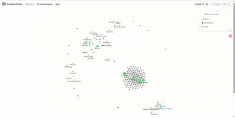

# docusaurus-plugin-graph-view

[](https://www.npmjs.com/package/docusaurus-plugin-graph-view)
[](https://github.com/whoisltd/docusaurus-plugin-graph-view/blob/main/LICENSE)

> An interactive, knowledge graph for your [Docusaurus](https://docusaurus.io/) site.

<p align="center">
  
</p>

## Features

- **Force-Directed Graph** — Powered by [d3-force](https://github.com/d3/d3-force) and rendered on 2D Canvas for smooth performance, even with large document sets.
- **Semantic Zoom** — Labels appear progressively as you zoom in; tag and neighbor labels are always visible on hover.
- **Tag-Based Clustering** — Frontmatter `tags` are automatically extracted and rendered as hub nodes, connecting related documents visually.
- **Multi-Path Scanning** — Aggregate notes from multiple content directories (e.g., `docs`, `blog`) in a single graph.
- **Deep Navigation** — Automatic URL mapping that preserves nested folder structures and respects frontmatter `slug` overrides.
- **Content Preview** — Hover or click any document node to see a summary preview and its tags in a side panel.
- **Dark Mode Support** — Adapts to your Docusaurus theme automatically.
- **Search & Filter** — Built-in search bar to find tags and notes instantly, with highlighted matching nodes.
- **Interactive Highlighting** — Hover a node to highlight its direct neighbors and connecting links with animated particles.

## Installation

```bash
npm install docusaurus-plugin-graph-view
```

**Peer dependency:** `@docusaurus/core >= 3.0.0`

## Usage

Add the plugin to your `docusaurus.config.js`:

```javascript
module.exports = {
  plugins: [
    [
      'docusaurus-plugin-graph-view',
      {
        paths: ['docs'],         // Directories to scan for .md/.mdx files
        routePath: '/graph',     // Route where the graph page will be accessible
        title: 'Knowledge Graph', // Page title
      },
    ],
  ],
};
```

Then visit `/graph` on your site to see the interactive knowledge graph.

### Configuration Options

| Option      | Type       | Default              | Description                                      |
|-------------|------------|----------------------|--------------------------------------------------|
| `paths`     | `string[]` | `['docs']`           | Content directories to scan for Markdown files.  |
| `routePath` | `string`   | `'/graph'`           | URL route for the graph page.                    |
| `title`     | `string`   | `'Knowledge Graph'`  | Page title shown in the browser tab.             |

### How It Works

1. At build time, the plugin walks every `.md` and `.mdx` file in the configured `paths`.
2. Frontmatter (`title`, `tags`, `slug`) is extracted via [gray-matter](https://github.com/jonschlinkert/gray-matter).
3. Each document becomes a node; each tag becomes a hub node. Edges connect documents to their tags.
4. The graph data is injected as Docusaurus global data and rendered client-side using [react-force-graph-2d](https://github.com/vasturiano/react-force-graph).

## Contributing

Contributions, issues, and feature requests are welcome!
Feel free to check the [issues page](https://github.com/whoisltd/docusaurus-plugin-graph-view/issues).

## License

MIT © [whoisltd](https://github.com/whoisltd)
